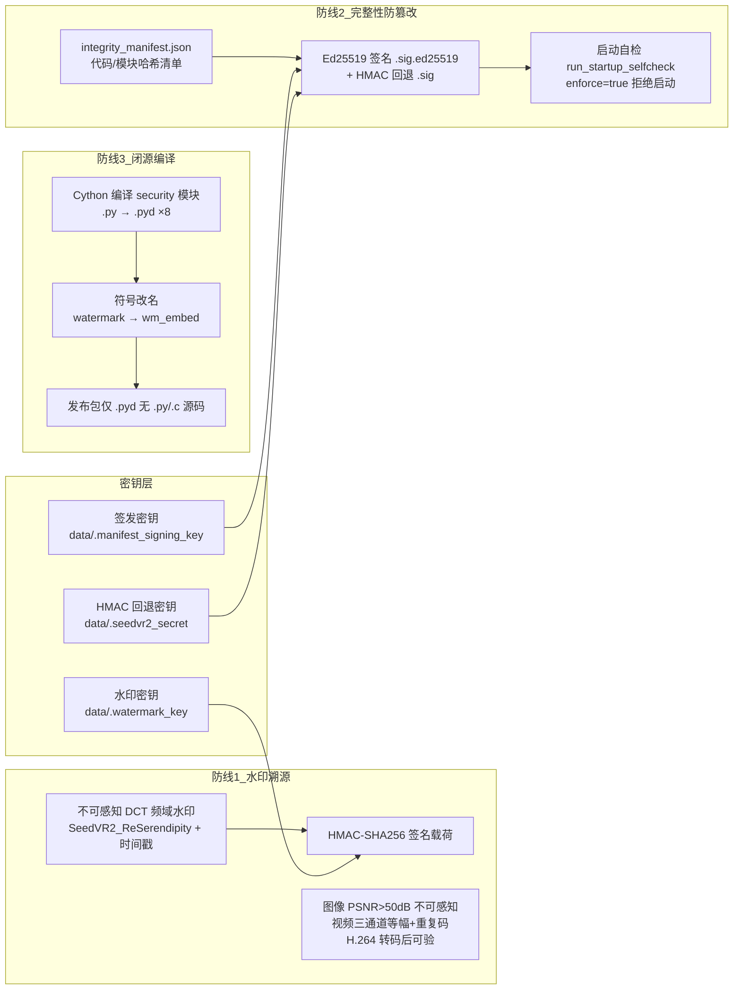

# AI 应用分发安全加固指南（SeedVR2-lite 实战复盘）

> **适用场景**：开源（或半开源）的 AI 工具对外分发成桌面应用/便携包，需要保护"水印溯源、防篡改、签名密钥"三件事，同时不破坏开源承诺与合规义务。
> **实例项目**：SeedVR2-lite（Apache-2.0 开源，GitHub Release 分发 Windows 便携包/桌面版，FastAPI + WinPython 便携解释器）。
> **本文用途**：把"分发出去之后如何保护"的完整方案——威胁模型、三大防线、密钥全生命周期、CI 发布门禁、开源与闭源平衡、合规落地——整理成可复用的操作手册，供其他 AI 项目照做。
> **配套**：本文是《桌面应用分发全流程指南》的安全加固篇；那份文件讲"怎么打包分发出去"，本文讲"分发出去后如何防拆解、防伪造、防篡改、可举证"。

---

## 一、安全模型（动手前先认清边界）

### 1.1 铁律：客户端侧没有"不可破解"

软件跑在用户机器上，用户有 root——**客户端侧"防破解"只有程度之别，没有不可破**（DRM 领域公认定律）。所以：

- **不要追求"破解不了"**，追求"**成本高于收益** + **事后可举证** + **法律可追责**"。
- 水印的价值定位是**事后取证 + 合规**，不是事前阻止。
- 算法可以公开（开源仓库里就是公开的），**防线建立在密钥保密 + 提高移除成本 + 事后取证**上。

### 1.2 威胁模型

| 威胁 | 攻击者能力 | 防线 | 边界（承认做不到的） |
|---|---|---|---|
| 顺手拆水印 | 普通用户，读 .py 源码找嵌入点 | 闭源编译 + 符号改名 + 注释剥离 | 铁了心读 GitHub 源码的人拦不住 |
| 伪造官方水印/签名 | 拿到签发密钥的人 | **密钥绝不入库、不入包、只留签发侧** | 密钥泄露则防线全失（→ §三） |
| 篡改代码/清单后运行 | 逆向编译产物、改字节 | 完整性清单 + Ed25519 签名 + 启动自检 enforce | 篡改者可自签清单，除非信任根（公钥）可信 |
| 删除 AI 内容标识 | 恶意用户 | 签名水印"能证明对方删过" | 删除本身防不住，但**删除/篡改 AI 标识违法**（合规兜底） |

### 1.3 行业共识：算法公开、密钥保密

- **Google SynthID**：文本水印算法开源，生产系统图像/视频水印闭源，**密钥空间隔离**（开源实现用自定密钥，与生产密钥完全不通）。
- **Adobe C2PA**：标准与工具全开源，保密的只有签名私钥（HSM/设备安全存储）。
- **Meta Content Seal**：算法全开源（含红队工具），安全性押在密钥保密 + 模型级鲁棒性。
- **翻车案例**：CyanogenMod 用公开测试密钥签名 → 恶意软件持同一把密钥获系统级权限；SmartTube（2025.12）签名密钥泄露 → 攻击者发布带合法签名的恶意版本。**密钥泄露比源码泄露严重一个量级。**

> **结论**：SeedVR2-lite 的结构（算法开源 + 签名密钥只留签发机 + 离线备份 + 空间隔离）与 SynthID/C2PA 同构，是行业标准姿势。

---

## 二、三大防线架构



| 防线 | 回答的问题 | 关键实现 | 失效后果 |
|---|---|---|---|
| **水印溯源** | "这段输出是不是你的模型生成的？" | DCT 频域不可感知水印 + HMAC 签名载荷（无密钥不可伪造） | 无法举证侵权 |
| **完整性防篡改** | "这个包是不是被改过？" | 清单哈希 + Ed25519 签名 + 启动自检 enforce | 篡改后可运行（投毒路径） |
| **闭源编译** | "源码里的算法/参数是不是被直接读走？" | Cython .pyd + 符号改名 + 注释剥离 | 普通用户照着注释定点拆水印 |

> 三条防线互相依赖：闭源编译挡住"顺手改"，完整性挡住"改完还能跑"，水印提供"事后可举证"。**密钥层是三条防线的共同信任根**。

---

## 三、密钥管理全生命周期（最优先做对的事）

### 3.1 三类密钥各管什么

| 密钥 | 文件 | 用途 | 保密边界 |
|---|---|---|---|
| 清单签名私钥 | `data/.manifest_signing_key`（Ed25519 PEM） | 完整性清单签名 | **只留签发机 + CI Secret + 离线备份**；公钥入包 |
| 水印密钥 | `data/.watermark_key` | 水印载荷 HMAC 签名 | 不入库、不入包、离线备份（SOP-17） |
| HMAC 回退密钥 | `data/.seedvr2_secret`（64B） | 清单 HMAC 回退验证、CSRF | 权限收紧（0600/icacls）+ 读取时自愈 |

### 3.2 分发通道定案：CI Secret 注入（SOP-19）

密钥分发信任模型只有两个候选，**选 CI Secret、否掉打包机自签**：

| 方案 | 结论 |
|---|---|
| **CI Secret 注入**（`MANIFEST_SIGNING_KEY_B64`） | ✅ 采用。CI runner 用完即毁、Secret 不落磁盘明文、产物绝不含私钥、SLSA provenance 保持可复现 |
| 打包机自签 | ❌ 否掉。同一产物多把签发密钥 → 验签信任根分裂；构建机失陷即私钥泄露 |

**标准操作链**（新增或重签一次发布链）：
1. 生成密钥对：`python scripts/generate_manifest_signing_key.py`（私钥 → `data/.manifest_signing_key`，公钥 → 仓库内 `manifest_signing_public_key.pem`）。
2. 私钥 PEM base64 → GitHub repo Secret：`gh secret set MANIFEST_SIGNING_KEY_B64`。
3. **配套校验**：签名脚本签名后立即用内置公钥回验，错配即 fail；构建脚本 A-6 闸门断言 payload 公钥 == 仓库公钥（SHA256 一致）。
4. 离线备份私钥（保险库/加密介质，SOP-17），备份后本机副本可删除。
5. 轮换：重新生成密钥对 → 重设 Secret → 重算并重签 manifest → CI 完整发布验证一轮。

### 3.3 密钥文件权限自愈

- 密钥文件持久化后**必须权限收紧**：POSIX `0600`；Windows 用 `icacls /inheritance:r /grant:r <user>:F` 去继承、仅当前用户完全控制。
- **读取时自愈**：`get_secret_key()` 每次读取都调用 `harden_secret_file_permissions()`，历史部署的过宽权限会在下次读取时自动修复。
- 测试护栏：临时目录内跳过 icacls（避免破坏 pytest 临时目录回收），权限测试独立覆盖。

### 3.4 空间隔离：正式分发不注入签发密钥（SOP-18）

- **决策**：互联网正式分发版**不注入** `SEEDVR2_WATERMARK_KEY` / `MANIFEST_SIGNING_KEY_B64`；密钥只存在于构建机 / CI Secret / 离线备份。
- **代价（必须明示）**：分发版每机首启自生成水印密钥 → 官方无法跨实例验证用户机上产物的签名；但反过来也没人能用你的密钥伪造"可通过你签名验证"的水印。
- **受信部署可选**：企业/自建环境可用 `SEEDVR2_WATERMARK_KEY` 统一注入签发密钥实现官方举证（SRE 场景）。

---

## 四、CI 发布门禁：解包冒烟验收（GOTCHAS #94/#98）

### 4.1 门禁五步（发布前必须全过）

```text
① 构建     powershell -File scripts/build_portable_bundle.ps1 -Component core,torch,model-shared,model-fp8 -ClosedComponentsZip build\closed.zip
② 拆包验证  归档内 security/ 为 8 个 .pyd 且无 .py/.c 源码；config.yaml integrity_enforce: true；
           清单条目完整；manifest_signing_public_key.pem 验签 PASS（Ed25519）
③ 负向断言  scripts/test_portable_bundle.ps1 退出码 0（无 .py/.watermark_key/注释残留）
④ 篡改模拟  改任一 .pyd 1 字节 → 哈希与清单不一致（启动自检将拒绝运行）
⑤ 冒烟启动  解包后真实启动自检，Ed25519 验签必须 PASS（便携 python 含 cryptography）
```

> **纪律**：任何要分发给外部用户的便携包，发布前**必须**在构建机真实跑完上述验证，禁止"构建后不验证直接上传 Release"——否则可能出现对方拿到包无法启动 / 防篡改失效的严重事故。CI 的 workflow 只是兜底，**本地门禁不得省略**。

### 4.2 冒烟前诊断脚本（定位环境差异的关键）

在冒烟启动前，用**便携 python + payload 闭源 pyd** 直接调用与服务器启动自检**同一个验签函数**，逐环节打印：

```text
[diag] cryptography 50.0.1 import OK      # 依赖是否可用
[diag] manifest exists=True path=...      # 文件是否在包内
[diag] sig exists=True path=...           # 签名文件是否在包内
[diag] pub exists=True path=...           # 公钥是否在包内
[diag] PORTABLE_VERIFY=True               # 验签结果（True/False）
```

**True/False 直接二分**：False → pyd/环境问题（依赖、文件缺失）；异常 → 启动路径问题。这比"服务日志报验签失败"少一轮猜测。

### 4.3 环境差异排查方法论（8 轮 CI 调试总结）

遇到"构建期全绿、便携包启动自检红"这类**环境敏感**问题，按此顺序收敛：

1. **二分**：构建期验签 True vs 便携验签 False → 差异收敛到便携 python 环境。
2. **逐环节诊断**：依赖 import → 文件存在性 → 验签结果 → 异常类型，把"环境问题"和"逻辑问题"分开。
3. **排除法记录**：签名文件丢失？密钥不配套？公钥错位？——每排除一个就记录，避免下一轮重复验证。
4. **结论要能定位到包管理器行为**：本例根因是 WinPython 3.12.10.1 经 **7z 解 NSIS 后预装 cryptography 丢失**（构建期无法发现，只有便携 python 环境暴露）。

### 4.4 便携依赖铁律

- **便携解释器依赖必须显式钉装**（`launcher/requirements-small.txt` 逐条 `==` 锁定），**不要依赖上游预装**——7z 解 NSIS 不保证还原安装器全部内容。
- 三处依赖清单同步：`requirements.txt`（范围）/ `requirements-lock.txt`（开发锁定）/ `requirements-small.txt`（便携钉装）。
- CI 运行器 Python 是"裸"的（只有标准库）：脚本用啥第三方包，在依赖安装步骤**一次装全**（含该脚本全部 import，不只当前报错那个）。

---

## 五、开源与闭源的平衡（Apache-2.0 下分发闭源组件）

### 5.1 法律与协议边界

| 问题 | 结论 |
|---|---|
| Release 和仓库内容必然关联吗？ | **不必然**。GitHub Release 资产是挂在 tag 上的任意文件；唯一强制公开的是 tag 对应的 Source code zip/tar.gz 快照 |
| 某些代码不上传仓库、Release 正常，可行吗？ | 可行：私有仓库 + CI 用 deploy key/PAT 拉取 → 编译 .pyd → 打进包。**但** SLSA/provenance 的"源码可核验"卖点部分失效，须公开声明 |
| Apache-2.0 要求二进制分发附带源码吗？ | **不要求**（这点与 GPL 不同）；公开仓库里保留对应源码即可 |
| 《AI 生成合成内容标识办法》要求标识机制源码公开吗？ | 不要求；不可见水印算法闭源恰是行业常态 |

### 5.2 业界先例

| 模式 | 代表项目 | 做法 |
|---|---|---|
| 构建期注入闭源组件 | VS Code / Chrome | 仓库 MIT/BSD 全公开，但官方安装包注入未开源遥测/编解码器/专有扩展；社区 VSCodium 剔除后重编译验证了分界 |
| Open-Core 分层 | GitLab / Elastic / MongoDB | 基础版开源，企业功能闭源只进商业发行版 |
| 物理隔离 | 各类商业开源项目 | 公开仓库只留 git submodule 指针指向私有仓库，CI 用凭证拉取 |

> **关键**：走闭源注入的项目都**公开声明**（VS Code 的 license 明示二进制非 MIT，GitLab 标出 ee 目录）——**隐瞒比公开更伤信任**。README/NOTICE 写明"某组件为闭源构建"。

### 5.3 推荐路径（按成本排序）

1. **源码留公开仓库 + 发布包 Cython 编译 + 剥离注释 + 符号改名**——挡住 95%"拿到包读 .py 定点拆水印"的普通用户，守住开源承诺与 provenance。**推荐默认**。
2. **私有仓库 + CI 注入**——更彻底但更贵；只有愿意接受"发布产物不再可复现验证"时才值得上。
3. **服务端推理**——唯一架构级强保密方案（水印在你基础设施内嵌好再返回），但和本地 GPU 工具的产品定位冲突，一般不值得。

> **一个回不去的点**：算法/参数/嵌入坐标一旦带注释进公开仓库，Apache-2.0 授权不可撤销，fork 和缓存拿不回来。**"保密"只对新改写的版本有意义**。

---

## 六、合规落地（AI 生成合成内容标识）

- **义务**：任何 AI 生成合成内容标识义务照常履行——分发版推理输出**仍嵌入** `SeedVR2_ReSerendipity + 时间戳` 的频域水印。
- **失败策略**：早期"水印失败静默跳过"（fail-open）构成合规缺口；策略化后为**失败重试 1 次 → 写 `.provenance.json` 侧车元数据（默认）→ 或直接阻断产出（block 档）**，并记审计事件。
- **对外承诺**：`PRIVACY_POLICY.md` 声明水印密钥、配置只存本机，不随仓库分发。
- **法律意义**：恶意删除/篡改 AI 内容标识本身违法；签名水印是"能证明对方删过"的手段，威慑和法律意义大于技术对抗意义。

---

## 七、避坑指南（全部为实战踩过的坑）

### 1. 便携 python 丢 cryptography → 自检误报「清单缺少有效签名」（GOTCHAS #98）
- 现象：构建期签名/公钥/验签全部 PASS，便携包启动自检却报"缺少有效签名"，enforce 拒绝启动。
- 根因：WinPython 3.12.10.1 经 **7z 解 NSIS** 后预装 cryptography 丢失 → Ed25519 验签依赖不可用 → 自检回退 HMAC → 包内无 HMAC 密钥 → 验签失败。
- 修复：便携依赖显式钉装 `cryptography==50.0.1`；冒烟前加诊断脚本。
- **教训**：7z 解 NSIS ≠ 正常安装；便携解释器依赖必须显式钉装而非依赖上游预装。

### 2. CI Secret 与仓库公钥不配套（GOTCHAS #97）
- 现象：A-6 报告"已签名"，启动验签却失败。
- 根因：Secret 里装的私钥与仓库内置公钥不是一对。
- 修复：签名后**立即用内置公钥回验** + 构建期 **payload 公钥 == 仓库公钥 SHA256 一致性闸门**，错配直接 fail。
- **教训**：密钥配套是双向的，光有"能签名"不够，要证明"签出来能被自己的公钥验过"。

### 3. CI 内联 Python 代码在 YAML 块标量里易碎
- 现象：冒烟诊断内联 `python -c "..."` 在 workflow 里报 YAML 解析错误（here-string 缩进、引号转义）。
- 修复：**诊断脚本进仓库**（`scripts/diag_*.py`），CI 只调脚本路径；本地也能复用。
- **教训**：CI 里超过 3 行的逻辑一律落脚本文件，别内联。

### 4. 独立诊断 job 反而拖红整体
- 现象：加了一个"独立快速诊断" job 想提前出答案，连续三轮在下载步骤失败（10s/10s/14s），主链全绿整体仍红。
- 修复：删除该 job——它的用途已被主链冒烟前诊断覆盖。
- **教训**：辅助 job 若不稳定，宁可并入主链诊断；"锦上添花"的 job 会让发布门禁失去确定性。

### 5. 远程 main 被外部提交推进 → push 连续被拒
- 现象：push 报 non-fast-forward，远程 main 出现 dependabot/codeql 等外部提交。
- 修复：`git pull --rebase origin main` 后重推；**同时取消基于旧 HEAD 误触发的 CI run**，避免浪费轮次。
- **教训**：rebase 是纪律不是选项；触发 CI 前确认 HEAD 是最新的。

### 6. 密钥配套闸门缺失 → 防篡改信任根是虚的
- 现象：曾讨论"发布版启用 enforce 但清单签名密钥分发未定"→ 破解者自签一份"全部通过"的清单即可绕过 enforce。
- 修复：SOP-19 定案 CI Secret 注入 + 公钥配套闸门 + enforce 开启。
- **教训**：**enforce 的前提是验签信任根可信**；密钥分发决策不定，enforce 等于没开。

### 7. 日志拉取被截断（CI 排障效率）
- `gh run view --log | Select-String` 会被 System.Text 截断；改用 `gh run view --job <id> --log` 按 job 拉。
- 冒烟失败后 artifact 不可下载（门禁在 artifact 步骤前失败）——**诊断输出必须打日志**，别指望事后下包。

---

## 八、安全发布检查清单（每次发版照做）

```text
[ ] 1. 密钥就绪：MANIFEST_SIGNING_KEY_B64 已设且与仓库公钥配套（A-6 闸门验证）
[ ] 2. 签名回验：sign_integrity_manifest.py 签名后内置公钥回验 PASS
[ ] 3. 便携依赖：requirements-small.txt 覆盖 cryptography 等全部自检依赖（显式钉装）
[ ] 4. 发布门禁 ①-⑤ 全过：构建 / 拆包验证（8 pyd 无源码）/ 负向断言 / 篡改模拟 / 冒烟启动验签 PASS
[ ] 5. 冒烟前诊断 PORTABLE_VERIFY=True（便携 python + payload pyd 同函数验签）
[ ] 6. 产物不含：.py 源码、.watermark_key、.manifest_signing_key、.seedvr2_secret、config 明文密钥
[ ] 7. CI 整体全绿（build-bundles + selftest + quality-gate），无辅助 job 拖红
[ ] 8. 密钥备份：私钥已离线备份（SOP-17），密钥轮换后旧水印可验证性已评估
[ ] 9. 合规：config.yaml integrity_enforce: true；水印失败策略非 fail-open；PRIVACY_POLICY 承诺一致
[ ] 10. 透明声明：README/NOTICE 写明闭源构建组件（若走编译注入路线）
```

---

## 九、给其他项目的可复用要点（TL;DR）

1. **先建威胁模型**：客户端侧无不可破，追求"成本高于收益 + 事后可举证 + 法律可追责"，不追求"破解不了"。
2. **算法公开、密钥保密**：水印/签名算法开源没问题，**密钥绝不入库、不入包、只留签发侧、离线备份**——密钥泄露比源码泄露严重一个量级。
3. **密钥分发走 CI Secret**：否掉打包机自签；配套闸门（签名后回验 + 公钥 SHA256 一致）必须有。
4. **防篡改 = 清单 + 签名 + 启动自检 enforce**：但 enforce 的前提是验签信任根可信，先定密钥分发再开 enforce。
5. **便携依赖显式钉装**：7z 解 NSIS 会丢预装包；便携解释器依赖逐条 `==` 锁定，三份清单同步。
6. **冒烟前诊断脚本进仓库**：便携 python 直接调验签函数逐环节打印，True/False 二分环境问题；CI 内联代码易碎。
7. **闭源编译挡住普通用户**：Cython .pyd + 符号改名 + 注释剥离，挡 95%"读 .py 定点拆"；要公开声明，别做"伪开源"。
8. **合规兜底**：AI 标识失败策略从 fail-open 改为"重试 → 侧车元数据 → 阻断"，恶意删除标识违法是可追责的底气。
9. **门禁是纪律**：本地门禁 + CI 门禁同套规则，发布前全过才允许上传；辅助 job 不稳定宁可并入主链。
10. **文档沉淀**：每个坑记入 GOTCHAS（编号、现象、根因、修复、教训），SOP 沉淀为可执行步骤，AGENTS.md 把门禁写死——**让经验成为流程，而不是记忆**。

---

## 十、参考文档索引（SeedVR2-lite 仓库内）

| 文档 | 内容 |
|---|---|
| `docs/桌面应用分发全流程指南.md` | 桌面化分发的完整流程（架构/选型/阶段/避坑/清单） |
| `docs/agents/SOPS.md` + `docs/project/AI_DEV_SOPS.md` | SOP-4 修改核心模块后重算清单 / SOP-7 构建与发布分卷便携包 / SOP-16 发布前防篡改门禁 / SOP-17 密钥离线备份 / SOP-18 密钥空间隔离 / SOP-19 CI Secret 分发定案 |
| `docs/agents/GOTCHAS.md` | #90–#98（内联编号见「增量坑点索引」）：#90 编译中间产物泄露 / #91 硬链接穿透污染源码 / #92 清单漏 .pyd 条目 / #93 生成脚本移出跟踪 / #94 发布门禁纪律 / #95 符号改名 / #96 CI 编码 / #97 密钥配套 / #98 cryptography 丢失 |
| `docs/DATA_GOVERNANCE_ASSESSMENT.md` | 数据治理评估（密钥落盘、权限、manifest 签名状态） |
| `app/integrated_app/security/` | watermark.py / integrity_selfcheck.py / secret_key.py / manifest_signing_public_key.pem |
| `scripts/` | build_portable_bundle.ps1（A-6 闸门）/ diag_portable_verify.py / sign_integrity_manifest.py / test_portable_bundle.ps1 |
