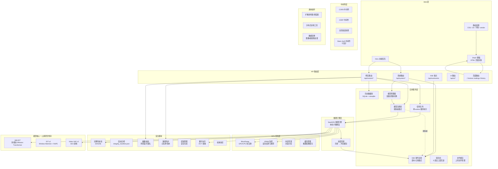
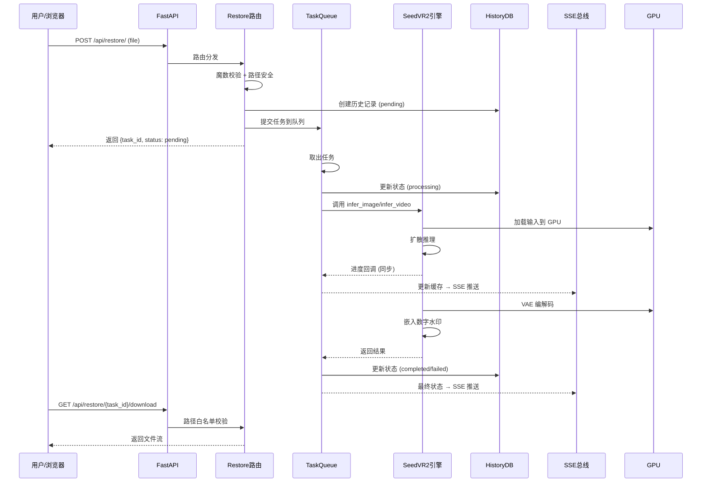
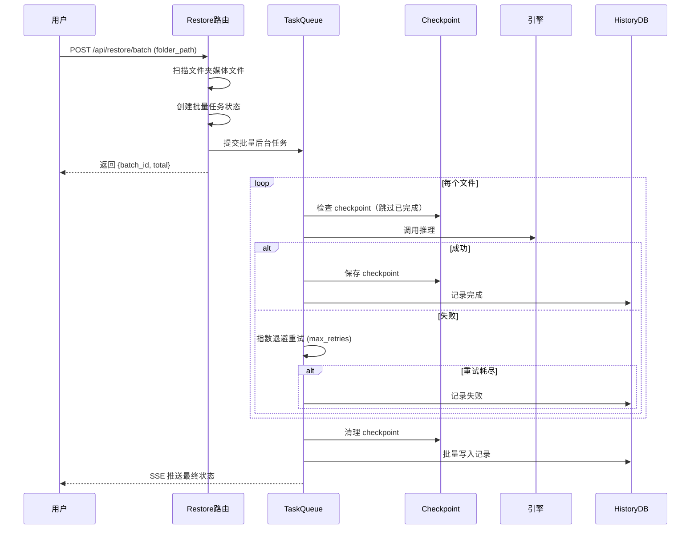
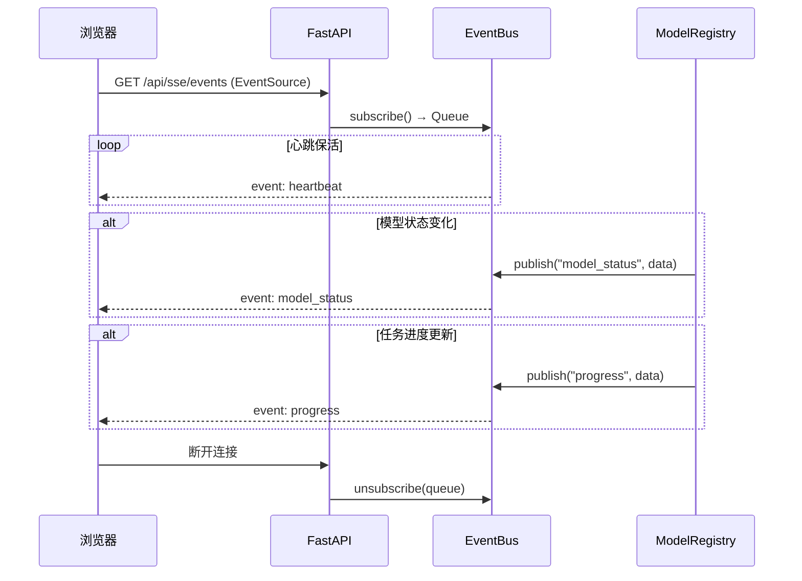
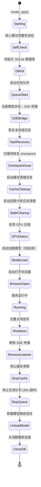

# SeedVR2 架构文档

本文档描述 SeedVR2 的分层架构、模块关系、请求流程和核心设计决策，帮助开发者快速理解项目全貌。

---

## 一、分层架构图

---

## 二、请求流程图

### 2.1 单文件修复流程

### 2.2 批量修复流程

### 2.3 SSE 事件流

---

## 三、应用生命周期

---

## 四、模块职责说明

### 4.1 Web 层

| 模块 | 位置 | 职责 |
|------|------|------|
| Jinja2 模板 | `templates/` | HTML 页面渲染（首页、修复、设置、历史、系统状态） |
| 静态资源 | `static/` | CSS、JS、字体、第三方 vendor 库 |
| htmx | 前端 | 局部刷新、SSE 监听、表单提交、文件上传 |

### 4.2 API 路由层

| 模块 | 前缀 | 端点 |
|------|------|------|
| 修复路由 | `/api/restore` | 单文件修复、批量修复、任务进度(SSE)、取消、结果查询、下载 |
| 系统路由 | `/api/system` | 健康检查、GPU 信息、模型管理、设置、语言切换、历史记录、性能指标 |
| SSE 端点 | `/api/sse` | 全局 SSE 事件流（模型状态、心跳、错误） |
| 页面路由 | `/` | 首页、修复页、设置页、历史页、系统状态页 |

路由自动发现：`routes/__init__.py` 使用 `pkgutil` 递归扫描 `routes/` 包，发现带 `router` 属性的模块自动注册。

### 4.3 应用服务层

| 模块 | 类 | 职责 |
|------|-----|------|
| 任务队列 | `TaskQueue` | 单 worker 顺序执行，避免 GPU OOM；支持取消、超时、最大队列限制 |
| 历史数据库 | `HistoryDB` | SQLite + aiosqlite 异步；支持分页、筛选、全文搜索、批量插入 |
| SSE 事件总线 | `EventBus` | 发布/订阅模式；WeakSet 管理订阅者；会话隔离；线程安全 publish |
| 国际化 | `I18n` | JSON 翻译文件；三层回退：指定→英文→key；扁平键优先查找 |
| 文件缓存 | `FileCache` | 上传文件存储；TTL 过期清理；子目录分类（image/video） |
| 模型管理器 | `ModelManager` | 模型加载/卸载/切换；SHA256 校验；自动精度选择 |
| 模型注册表 | `ModelRegistry` | 单例模式；观察者模式通知状态变化；引擎实例管理 |

### 4.4 推理引擎层

| 模块 | 职责 |
|------|------|
| `SeedVR2Engine` | 核心推理引擎；单步扩散修复；图像/视频统一接口 |
| `ImageInferenceConfig` | 图像推理配置（分辨率、种子、精度、BlockSwap 等） |
| 进度回调 | 同步回调函数 → 更新内存缓存 → SSE 推送（注意：回调必须为同步函数） |

### 4.5 GPU 优化层

| 模块 | 职责 |
|------|------|
| `BlockSwap` | Transformer 块 GPU/CPU 间动态换入换出，降低显存峰值 |
| `VRAMMonitor` | 实时显存监控；估算公式：模型基线 + 分辨率开销 + 帧缓冲 |
| `MemoryManager` | 分段内存分配；显存碎片化治理 |
| `CacheManager` | 推理中间结果缓存；避免重复计算 |

### 4.6 安全模块

| 模块 | 文件 | 职责 |
|------|------|------|
| 完整性校验 | `integrity_check.py` | 模型权重 SHA256 校验 |
| 启动自检 | `integrity_selfcheck.py` | 核心模块哈希比对（`integrity_manifest.json`） |
| 魔数校验 | `magic_check.py` | 上传文件内容类型验证（防伪装扩展名） |
| 路径防护 | `path_guard.py` | 白名单机制；`realpath()` 解析；`..` 拒绝 |
| 密钥管理 | `secret_key.py` | 安全随机密钥生成 |
| 数字水印 | `watermark.py` | DCT 频域不可感知水印嵌入与提取 |
| 权重加密 | `weight_encryption.py` | 模型权重加密/解密支持 |

### 4.7 模型核心（上游研究代码）

| 模块 | 来源 | 职责 |
|------|------|------|
| `model_lib/dit/` | ByteDance NaDiT (Apache-2.0) | MM-DiT 架构：多模态 Diffusion Transformer |
| `model_lib/dit_v2/` | 衍生 | Window Attention + RoPE 位置编码 |
| `model_lib/video_vae_v3/` | SD3 Video VAE (Apache-2.0) | 视频变分自编码器：时间分块 + 内存优化 |

> ⚠️ `model_lib/` 目录为上游研究代码镜像，**不可随意修改**。类型检查和覆盖率统计均已排除。

### 4.8 通用组件

| 模块 | 位置 | 职责 |
|------|------|------|
| 扩散组件 | `common/diffusion/` | 采样器、调度器、时间步 |
| 分布式工具 | `common/distributed/` | 分布式训练辅助 |
| 数据变换 | `data/` | 图像/视频预处理（resize、归一化、帧提取） |

---

## 五、关键设计决策

### 5.1 单 Worker 任务队列

**决策**：使用单 worker 顺序执行推理任务，而非并发。

**原因**：
- GPU 显存有限，并发推理容易导致 OOM
- 批量任务中文件大小不一，并发难以预测显存需求
- 顺序执行简化了状态管理和错误恢复

**代价**：吞吐量受限，但通过 SSE 实时进度推送缓解用户等待焦虑。

### 5.2 路由自动发现

**决策**：使用 `pkgutil.iter_modules` 递归扫描路由包，自动注册带 `router` 属性的模块。

**优势**：新增路由只需在 `routes/` 目录下创建文件并定义 `router = APIRouter(...)`，无需修改注册代码。

### 5.3 进度回调必须为同步函数

**决策**：推理在工作线程中同步执行（`asyncio.to_thread`），进度回调为同步函数。

**原因**：若回调为 async 函数，在同步执行环境中只会产生未 await 的 coroutine，函数体不会执行，导致进度永远停留在 0%。

### 5.4 观察者模式桥接模型状态与 SSE

**决策**：`ModelRegistry` 使用观察者模式，`app_server.py` 注册桥接监听器将状态变化转发到 `EventBus`。

**优势**：解耦 `ModelRegistry` 与 `EventBus` 的直接依赖；新增监听器无需修改 `ModelRegistry` 代码。

### 5.5 渐进式类型检查策略

**决策**：Mypy 配置为非严格模式（`strict=false`），排除 `model_lib/`（上游研究代码）和 GPU 优化路径。

**原因**：
- `model_lib/` 为上游镜像，不适合在本项目中添加类型注解
- GPU 推理路径无测试覆盖，类型检查会产生大量误报
- 渐进式采纳：保持应用层的真实类型错误检测，不强制全量注解

### 5.6 三层 i18n 回退机制

**决策**：翻译查找顺序为：指定语言 → 英文(en) → key 本身。

**原因**：确保任何 key 都有可显示的值，避免空白或异常。扁平键优先查找防止含点号的键被误判为嵌套结构。

---

## 六、技术栈总览

| 层级 | 技术 | 版本要求 |
|------|------|----------|
| 推理框架 | PyTorch (CUDA) | >= 2.4.0 |
| 后端 | FastAPI + Uvicorn | >= 0.115.0 |
| 前端 | Jinja2 + Bootstrap 5 + htmx | - |
| 数据库 | SQLite + aiosqlite | >= 0.20.0 |
| 实时通信 | SSE (Server-Sent Events) | - |
| 模型架构 | MM-DiT + Video VAE (SD3) | - |
| 代码质量 | Ruff + Black + Mypy + Pytest | - |
| E2E 测试 | Playwright + TypeScript | - |
| CI/CD | GitHub Actions (6 workflows) | - |

---

*文档更新时间：2026-08-10*
