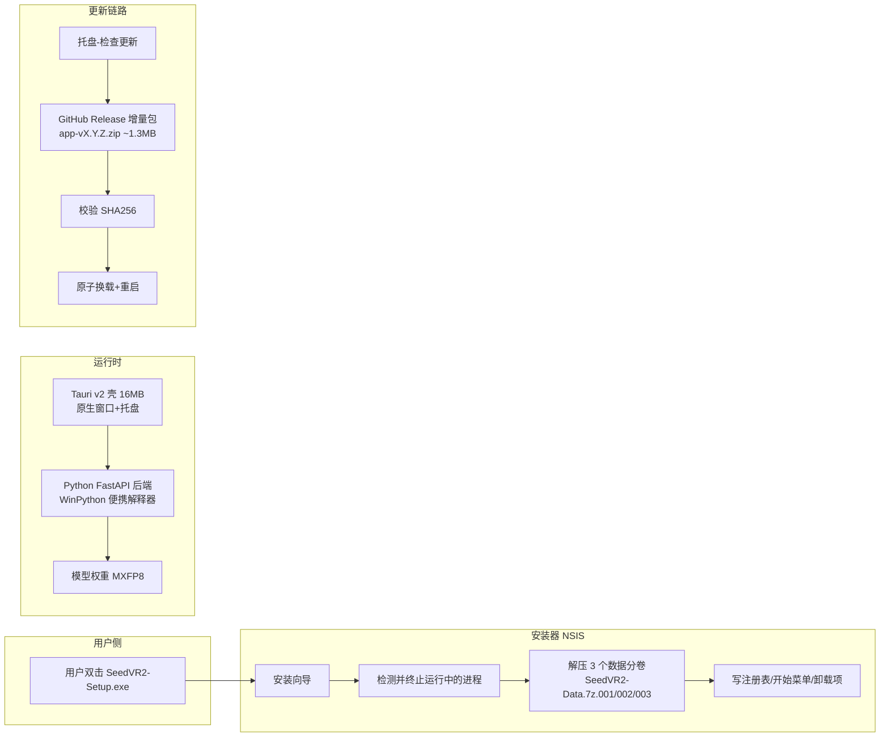

# AI 应用桌面化分发全流程指南（SeedVR2-lite 实战复盘）

> **适用场景**：Python 后端 + Web UI 的 AI 工具，需要对外分发成 Windows 桌面应用，要求"开机即用、免配置环境"。
> **实例项目**：SeedVR2-lite（基于 SeedVR2 扩散模型的视频/图像超分修复工具，Tauri v2 + Python FastAPI + NSIS + GitHub Release 分卷发布）。
> **本文用途**：把整个项目从"网页版"走向"桌面安装版"的完整流程、选型理由、踩坑与避坑整理成可复用的操作手册，供其他项目照做。

---

## 一、最终架构（先看清目标形态）



**核心分工**（每一层的更新策略不同，务必分开理解）：

| 层 | 内容 | 体积 | 更新方式 |
|---|---|---|---|
| 壳（Shell） | Tauri v2 桌面壳（desktop/src-tauri） | ~16MB | 随安装包/增量包更新 |
| 应用代码 | Python FastAPI + 前端模板 | 增量包 ~1.3MB | **增量更新**（每次发版只换这层） |
| 运行时 | WinPython 便携解释器 + 全部非 torch 依赖 | ~1.9GB | 安装包提供，**不随增量更新** |
| 计算依赖 | PyTorch cu132 wheels（离线装） | ~2.8GB | 安装包提供，**不随增量更新** |
| 模型权重 | SeedVR2-3B MXFP8 + VAE | ~2.7GB | 安装包提供，用户可自行替换，**不随增量更新** |

> 一句话：**增量更新只覆盖"功能代码"**，依赖/CUDA/模型交给安装包和用户，这样增量包才能小到 1MB 级、才能在 GitHub 上正常发布。

---

## 二、技术栈选型（为什么是这套组合）

| 需求 | 选择 | 理由 |
|---|---|---|
| 桌面壳 | **Tauri v2**（Rust） | 体积小（壳 ~16MB）、内存低、原生托盘/通知/拖拽；WebView 渲染与浏览器同内核（Edge WebView2） |
| 后端 | **Python FastAPI** | AI 推理生态全在 Python；复用原 Web UI 代码零重写 |
| 打包运行环境 | **WinPython 便携解释器**（内置全部非 torch 依赖） | 免安装 Python、免配环境、离线可用 |
| 安装器 | **NSIS 3.10**（makensis 编译） | 免费、脚本化、支持分卷解压/终止进程/写卸载项 |
| 发布渠道 | **GitHub Release + 分卷** | 免费、无需 CDN；单文件 ≤2GB 限制用 1900MB 分卷规避 |
| 增量更新 | **自研更新链路**（壳内实现） | 下载 app zip → SHA256 校验 → 原子换载 → 重启，失败回滚 |
| 代码签名 | **无（暂缓）** | 证书费用高；无签名会被 SmartScreen 拦截，需引导用户"仍然运行" |

**备选方案对比**（前期讨论过的）：

| 方案 | 结论 |
|---|---|
| 纯便携分卷包（7z 多卷 + 解压脚本） | 被桌面安装版取代；保留为"网页版/开发模式" |
| ComfyUI 官方便携版思路（自带 Python 整包解压即用） | 方向一致，但缺少安装器/卸载/增量更新，用户体验差 |
| PyInstaller 单文件打包 | 不适合 5GB 级依赖（torch+CUDA+模型），体积与启动速度不可接受 |
| 浏览器网页版 | 保留为开发/内部使用；对外分发体验不如桌面版 |

---

## 三、完整流程（分七个阶段）

### 阶段 1：确定分发模型与发布约束

1. **先定"哪些随包、哪些增量"**——参照上表分层，先画清楚再动手。
2. **确认平台硬约束**：
   - GitHub Release 单文件 ≤ **2GB**（实测按 1900MB 切片最稳）。
   - Windows SmartScreen：无代码签名证书必拦截，要有引导话术。
   - 用户机器需 NVIDIA 显卡 + 显存 ≥8GB + 磁盘 ≥15GB（在 README 写清）。
3. **定版本基线**：pyproject.toml 单一事实来源，tag 命名 `vX.Y.Z`，CI 从 pyproject 解析版本。

### 阶段 2：Tauri v2 桌面壳

- 目录：`desktop/src-tauri`，壳版本固定 `1.0.0`（应用真实版本由 Python 侧维护）。
- 必需能力：原生窗口（非浏览器标签）、**系统托盘**（显示/隐藏/检查更新/退出）、Windows Toast、文件拖拽、窗口状态记忆、**单实例**、**后端崩溃自动重启**。
- 后端集成：壳启动 Python 服务（WinPython 解释器），前端指向 `http://127.0.0.1:<port>`。
- **避坑**（详见 §四-6）：壳默认行为可能拉起系统浏览器 / 弹出控制台窗口，必须显式关闭默认打开浏览器、隐藏控制台，否则"正式程序"体验崩坏。

### 阶段 3：NSIS 安装器（含数据分卷）

- 产物：`SeedVR2-Setup-vX.Y.Z.exe`（~4MB）+ `SeedVR2-Data.7z.001/002/003`（共 ~5.3GB，按 1900MB 切片）。
- 安装流程：检测并**终止运行中的程序** → 解压数据分卷（7za）→ 写注册表/开始菜单/卸载项。
- 卸载流程：检测并终止运行中的程序 → 删文件 → 清注册表（`HKCU\Software\SeedVR2`、`Uninstall\SeedVR2`）→ 清 `%APPDATA%` → 删快捷方式。
- **NSIS 脚本必须 UTF-8 with BOM** 保存，否则中文乱码。
- 安装向导页：许可协议文本必须非空、自述文件（README）必须能正确显示（早期版本两处都出过 bug）。

### 阶段 4：GitHub Release 分卷发布

- 资产清单（以 v1.5.4 为例）：
  ```
  SeedVR2-Setup-v1.5.4.exe          # 安装器
  SeedVR2-Shell-v1.5.4.exe          # 壳（Tauri）
  SeedVR2-Data.7z.001/002/003       # 数据分卷（依赖+模型，5.3GB）
  app-v1.5.4.zip (+ .sha256)        # 增量更新包
  SHA256SUMS-v1.5.4.txt             # 全量校验文件（必须包含上面所有文件！）
  ```
- **上传顺序**：先小文件后大文件；大文件（5GB+）用后台任务传，避免中断；`gh release upload --clobber` 可重传覆盖。
- **发布后必须回读验证**：`gh release view --json assets` 确认资产数量齐全、`gh release download` 回读 SHA256SUMS 与实际文件哈希一致。

### 阶段 5：增量更新机制

- 更新包只含应用代码（app zip ~1.3MB），命名 `app-vX.Y.Z.zip`。
- 壳内链路：托盘"检查更新" → 请求 GitHub Release 最新 tag → 对比版本 → 下载 → **SHA256 校验** → **原子换载**（备份→替换→重启）→ 失败自动回滚。
- 三个易错点（全部踩过）：
  1. **网络通道**：Windows 下 Rust 默认 TLS 实现可能握手失败，改用 native-tls。
  2. **日志句柄占用**：更新时 Python 进程的日志句柄被锁 → 报 `os error 32`，必须先停后端再换载。
  3. **孤儿进程**：换载/重启后旧 Python 进程残留，需在壳里显式清理。

### 阶段 6：CI 与质量门禁（GitHub Actions）

- **Portable Release workflow**：tag `v*` 触发，job：build-bundles（下载模型→构建分卷→体积门禁→解包冒烟）+ Portable chain self-test（离线 fixture 端到端）。
- **CI - Backend Quality Gate**：ruff / black / mypy / API 契约审计 / pytest + coverage（gate ≥55%）。分支保护要求：`quality-gate (ubuntu)` + `quality-gate (windows)` + `Typecheck (mypy ratchet)`。
- **本地同步门禁**：pre-commit（ruff/black/yaml/结构守卫）+ pre-push `precheck.ps1`（与 CI 同套检查，拦截不合格 push）。
- 发布走手动 `gh release upload`（避免 workflow 自动上传污染已存在的 release）；workflow 的 `upload_to_release=false` 仅做构建验证。

### 阶段 7：仓库门面（README / About）

- README 以"当前分发方式"为准写（桌面版优先），版本徽章与真实版本一致，别让历史文案（便携分卷）占主导。
- About（仓库描述）控制在 350 字符内，中英双语，突出"桌面版对外分发 + 增量更新"。

---

## 四、避坑指南（全部为实战踩过的坑）

### 1. GitHub 单文件 2GB 限制 → 必须分卷
- 切片上限取 **1900MB**（留余量，7z 分卷头/尾部校验）。
- 分卷命名 `SeedVR2-Data.7z.001/002/003`，校验文件里逐卷列哈希。
- **漏传数据分卷 = 发布事故**：安装器解压数据必然失败。发布后第一件事就是核对资产数量。

### 2. CI 运行器 Python 环境缺包（最高频）
- GitHub Windows/Ubuntu 托管运行器自带的 Python 是"裸"的，只有标准库。
- 本项目连踩三包：`requests` → `rich` → `pyyaml`，全部是 `download_model.py` 的依赖。
- **避坑**：凡是 CI 里 `python xxx.py` 的步骤，先 `grep` 该脚本全部 `import`，第三方包一次性在依赖安装步骤补全；**不要只修当前报错的那个包**（"触类旁通"：把同脚本/同流程的其他第三方 import 一并检查）。

### 3. ruff/black 本地与 CI 判定不一致（isort 陷阱）
- 现象：本地 `ruff check .` 全过，CI 报 `I001`。
- 根因：`scripts/installer/pyproject.toml`（嵌套 pyproject）影响 ruff 配置发现——ruff 对每个文件找"最近的配置"，本地有该文件、CI checkout 没有，导致 `app` 包 first-party 判定不同。
- **避坑**：在根 pyproject 显式声明 `[tool.ruff.lint.isort] known-first-party = ["app"]`，并在所有嵌套 pyproject 同步；嵌套配置文件要么纳入版本管理要么删掉，避免"本地有 CI 无"的漂移。

### 4. 历史 lint 债务会突然拦 push
- 现象：push 被 pre-push 拦截，`check_layout.py` 报 `UP009/C401/UP031`，`task.py` 报 `I001/F811`。
- 根因：仓库长期累积的旧 lint 问题（UTF-8 声明多余、% 格式化、import 排序、重复 import），一旦 precheck 全仓扫描就暴露。
- **避坑**：修 lint 用 `ruff check --fix` + 手动处理不可自动修的项；改完跑全仓 `ruff check .` 和 `black --check`；**不要**用 `git push --no-verify` 绕过（会让门禁形同虚设）。

### 5. 前端引用不存在的后端路由（API 契约审计）
- 现象：`test_no_frontend_call_without_backend_route` 失败——`/favicon.ico` 在模板里被引用，但后端没有该路由。
- 避坑：静态资源引用一律走已挂载的 `/static/` 前缀（`/static/favicon.ico`），不要用裸根路径；模板改完跑 API 契约测试。

### 6. Tauri 壳拉起浏览器 / 弹出控制台（"正式程序"体验）
- 现象：启动后自动打开系统浏览器跳到一个不存在的页面；或弹出黑色终端窗口。
- 根因：壳默认打开了系统浏览器 / 未隐藏控制台（Python 子进程继承控制台）。
- 避坑：显式关闭默认打开浏览器、子进程 `CREATE_NO_WINDOW` 隐藏控制台、WebView 用应用内窗口；发布前在干净机器上实测启动行为。

### 7. 增量更新"点了没反应"
- 现象：托盘"检查更新"无任何反馈。
- 根因排查链（全部真实发生）：
  1. TLS 通道问题（native-tls）→ 请求失败但静默；
  2. 版本号显示旧值（about 页与实装版本不一致，壳硬编码/缓存）；
  3. 失败无弹窗（错误被吞）。
- 避坑：更新链路每一步都要有可见反馈（正在检查/有新版本/已是最新/失败原因）；版本号单一来源（从后端 `/api/system/health` 读真实版本，壳不要自己存）。

### 8. NSIS 安装器细节
- 脚本必须 **UTF-8 with BOM**，否则中文乱码/解析错误。
- 许可协议页文本为空 → 把协议内容正确编码进 `license.txt`。
- 自述文件页显示空白 → README 编码/路径问题，发布前逐页截图验证。
- 安装/卸载都要**先终止运行中的程序**（杀 Python + 壳进程），否则文件占用导致失败。
- 数据解压失败弹 `7za 错误码` → 检查 `$PLUGINSDIR` 与分卷路径，解压前先校验分卷存在且哈希匹配。

### 9. 卸载不干净（注册表残留）
- 卸载必须清理：`HKCU\Software\SeedVR2`、`Uninstall\SeedVR2`、`%APPDATA%\SeedVR2`、开始菜单快捷方式、桌面快捷方式。
- 用进程终止 + 删除的完整脚本，别只删安装目录。

### 10. SmartScreen 拦截（无代码签名证书）
- 现象：下载后双击安装被"Windows 已保护你的电脑"拦截。
- 处理：无力购买证书时，发布说明里写清"无签名属正常现象"，引导用户点"更多信息 → 仍然运行"；不要试图用假证书/绕过。
- 长期：攒钱上 Authenticode（EV 证书）或考虑微软商店。

### 11. 发布资产与构建产物混淆
- `dist/tauri-release/` 下同时存在 bundles（正式发布物）、staging（暂存）、installer（增量包）、旧便携分卷——**时间长了根本分不清**。
- 避坑：发布前清理过期产物（旧便携目录、旧分卷、旧 manifest），只保留当前版本资产；用版本号后缀命名杜绝覆盖混淆。

### 12. GitHub Actions 平台警告
- Node 20 弃用：checkout/setup-python 等 action 默认跑 Node 24，出现弃用警告属正常，暂不影响；如 action 强制 Node 20 可设 `ACTIONS_ALLOW_USE_UNSECURE_NODE_VERSION=true`（临时）。

---

## 五、发布检查清单（每次发版照做）

```text
[ ] 1. 版本号单一来源核对：pyproject.toml == about 页显示 == Release tag
[ ] 2. 本地 precheck 全绿（ruff/black/mypy/API contract）
[ ] 3. push main 后 CI 全绿（quality-gate ubuntu+windows、mypy ratchet、structure-guard、docs、security）
[ ] 4. 打 tag vX.Y.Z 前先手动 dispatch Portable Release 验证构建（upload_to_release=false）
[ ] 5. 构建产物齐全：Setup + Shell + 数据分卷×N + 增量包 + SHA256SUMS
[ ] 6. SHA256SUMS 覆盖【全部】资产（含数据分卷），下载回读验证
[ ] 7. gh release upload 上传全部资产（大文件后台传），完成后核对资产数量
[ ] 8. 干净机器（或卸载后）实测：安装 → 启动 → 修复 → 检查更新 → 卸载无残留
[ ] 9. README/About 与当前分发方式一致（版本徽章、文案、资产清单）
[ ] 10. 更新链路口径：托盘检查更新有反馈、失败有原因、版本显示正确
```

---

## 六、关键验证方式

| 环节 | 验证动作 |
|---|---|
| CI 修复 | 本地重跑对应测试/脚本（如 `test_portable_bundle.ps1`）→ push → 看 Actions 结果 |
| 依赖修复 | 不只修报错包，`grep` 全部第三方 import 一次补全；CI 重跑验证 |
| 发布完整性 | `gh release view --json assets` 数资产；下载 SHA256SUMS 与本地哈希逐行比对 |
| 安装/卸载 | 真机/虚拟机：安装向导逐页截图、卸载后查注册表与目录无残留 |
| 增量更新 | 从旧版本点"检查更新"，观察下载→校验→重启→版本号变化全链路 |
| 门禁一致性 | 本地 precheck 与 CI 必须同套规则（嵌套 pyproject 是漂移重灾区） |

---

## 七、给其他项目的可复用要点（TL;DR）

1. **先分层再动手**：壳 / 应用代码 / 运行时 / 计算依赖 / 模型权重——只有"应用代码"走增量更新，其余随安装包。
2. **GitHub 2GB 是硬约束**：一切大文件按 1900MB 切片，校验文件覆盖全部卷。
3. **CI 缺包是常态**：运行器 Python 裸奔，脚本用啥装啥，一次装全。
4. **本地与 CI 必须同配置**：嵌套 pyproject、ruff isort、precheck 规则，杜绝"本地绿 CI 红"。
5. **发布 = 上传 + 回读验证**：资产数量、校验文件、干净机器安装，缺一不可。
6. **无签名要写进发布说明**：SmartScreen 拦截是预期行为，不是 bug。
7. **更新链路每步可见**：静默失败是最差的用户体验，宁可多弹窗。
8. **门禁不许 --no-verify 绕过**：lint 债迟早要还，欠得越多拦得越狠。
